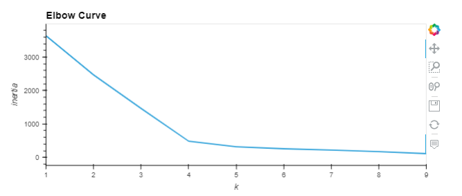
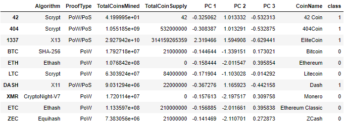
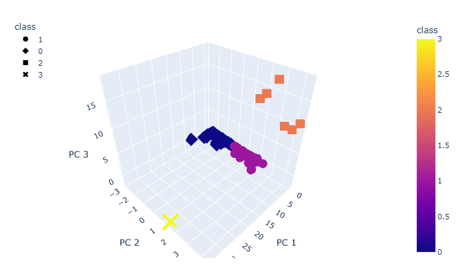
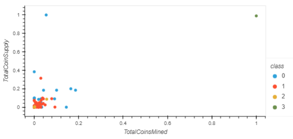

# Cryptocurrencies

The goal of this project was use unsupervised machine learning clustering algorithms to provide further information to help investigate cryptocurrencies from an investment perspective. First I had to load and transform the data in order 
to make the data usable. All cryptocurrencies that were not actively trading were filtered out, as well as those in the dataset with missing information. All columns that had non-numerical values were removed, or modified into a boolean
using get_dummies. Then the dimensionality was reduced using a PCA algorithm.

Then I created an elbow curve to determine the proper amount of clusters in preparation for use of the K-Means Clustering Algorithm.

4 clusters were created and were stored as classes in a dataframe with the PCA results and the rest of the cryptocurrency data. 

A 3d scatter plot was then created to visualize the different clusters.  

Finally a 2D scatterplot was created to help visualize the supply of each cryptocurrency and total coins mined after scaling the quantities. 

